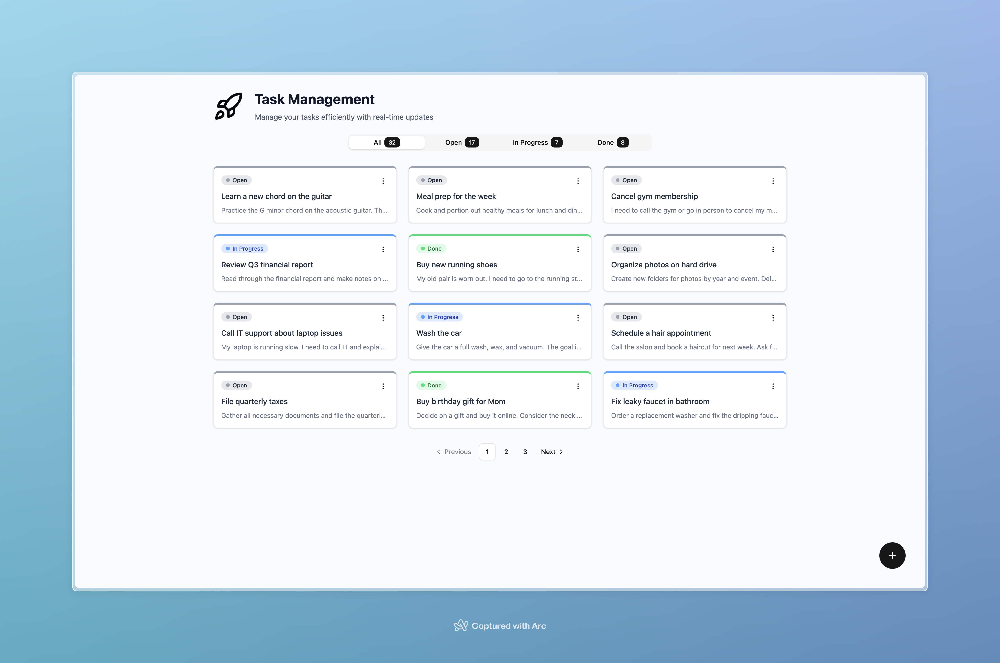

# Task Management Application

A full-stack task management application with real-time updates built with Vue 3, FastAPI, and PostgreSQL.



## Features

- ✅ CRUD operations for tasks
- 🔄 Real-time updates via Server-Sent Events
- 📱 Responsive design with Tailwind CSS
- 🐳 Fully containerized with Docker
- 🧪 Comprehensive testing suite
- 📊 Pagination and filtering
- 🎨 Modern UI with shadcn/vue components

## Using Docker

1. Clone the repository
2. Copy environment variables:
   ```bash
   cp .env.example .env
   ```
3. Start all services:
   ```bash
   docker compose up --build -d
   ```
4. Access the application:
   - Frontend: http://localhost:3000
   - Backend API: http://localhost:8000
   - API Documentation: http://localhost:8000/docs

## Development

### Frontend

More details in [frontend](frontend/README.md) folder

### Backend

More details in [backend](backend/README.md) folder

## License

This project is licensed under the MIT License.
